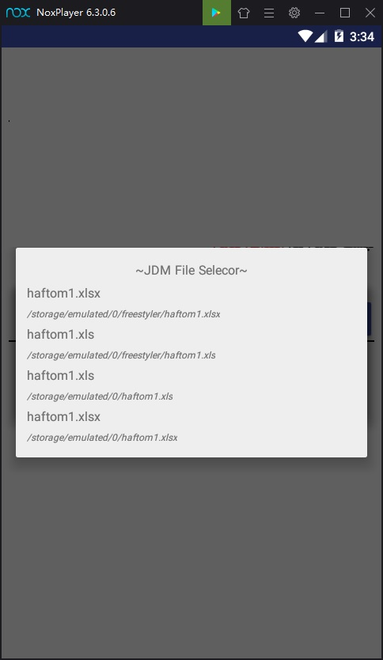

# Android FileSelector
copy/paste this class in your project [FileSelector.java](https://github.com/criss721/FileSelector/blob/master/FileSelector.java)



# How To Use : 

```java
new FileSelector(this, new String[]{FileSelector.XLS, FileSelector.XLSX}).selectFile(new FileSelector.OnSelectListener() {
      @Override
      public void onSelect(String path) {
        G.toast(path);
      }
    });

new FileSelector(this, new String[]{".jpg", ".jpeg"}).selectFile(new FileSelector.OnSelectListener() {
      @Override
      public void onSelect(String path) {
        G.toast(path);
      }
    });

findViewById(android.R.id.content).setOnClickListener(new View.OnClickListener() {
      @Override
      public void onClick(View v) {
        new FileSelector(ActivitySplash.this, new String[]{FileSelector.PNG}).selectFile(new FileSelector.OnSelectListener() {
          @Override
          public void onSelect(String path) {
            G.toast(path);
          }
        });
      }
    });
```
